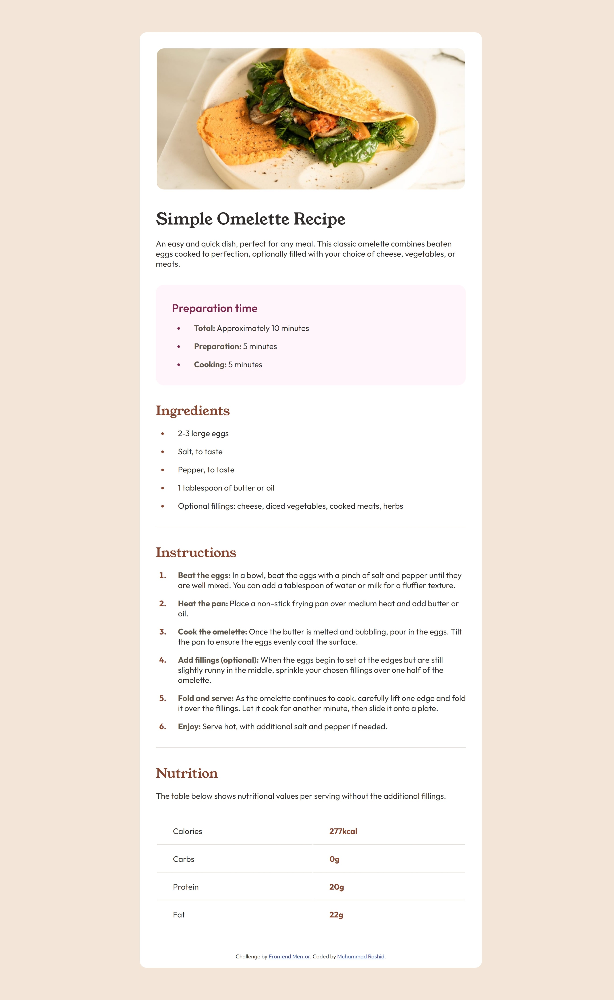

# Frontend Mentor - Recipe page solution

This is a solution to the [Recipe page challenge on Frontend Mentor](https://www.frontendmentor.io/challenges/recipe-page-KiTsR8QQKm). Frontend Mentor challenges help you improve your coding skills by building realistic projects. 

## Table of contents

- [Overview](#overview)
  - [Screenshot](#screenshot)
  - [Links](#links)
- [My process](#my-process)
  - [Built with](#built-with)
  - [What I learned](#what-i-learned)
  - [Continued development](#continued-development)
  - [Useful resources](#useful-resources)
- [Author](#author)

## Overview

### Screenshot



### Links

- Solution URL: (https://github.com/MH-Rashid/recipe-page)
- Live Site URL: (https://mh-rashid.github.io/recipe-page/)

## My process

### Built with

- Semantic HTML5 markup
- CSS custom properties
- Flexbox
- Mobile-first workflow

### What I learned

- My first serious html css project. I gained experience in the workflow of designing a webpage
- Had to revisit media queries but still not understanding it 100%
- How to use the semantic table element and some styling features
- How to add custom properties

```css
:root {
  --nutmeg: hsl(14, 45%, 36%);
  --dark-raspberry: hsl(332, 51%, 32%);
}
```

- That it's possible to style bullet points
```css
li::marker {
  color: var(--nutmeg);
}

ol li::marker {
  font-weight: bold;
}
```

### Continued development
- I need to thoroughly plan the structure and design beforehand. I also need to learn how to plan and create plans effectively. This will help me to write clean DRY code
- Specific areas
  - Media queries; Responsive design; Mobile-first workflow
  - Flexbox, CSS grid
  - Semantic HTML tags

### Useful resources

- [W3 schools docs on HTML and CSS](https://www.w3schools.com/) - This helped me to explore the functionality and uses for unfamiliar HTML tags and CSS properties/values. It was very useful and will use it going forward.

## Author

- Frontend Mentor - [@MH-Rashid](https://www.frontendmentor.io/profile/MH-Rashid)